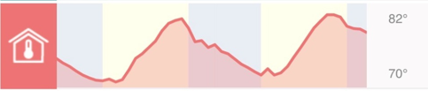
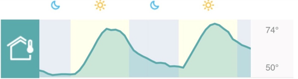
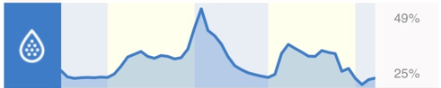
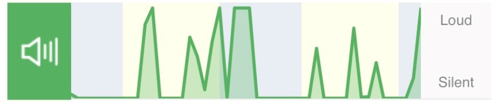
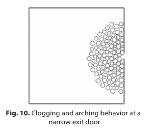
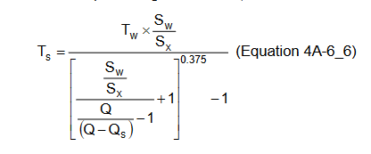
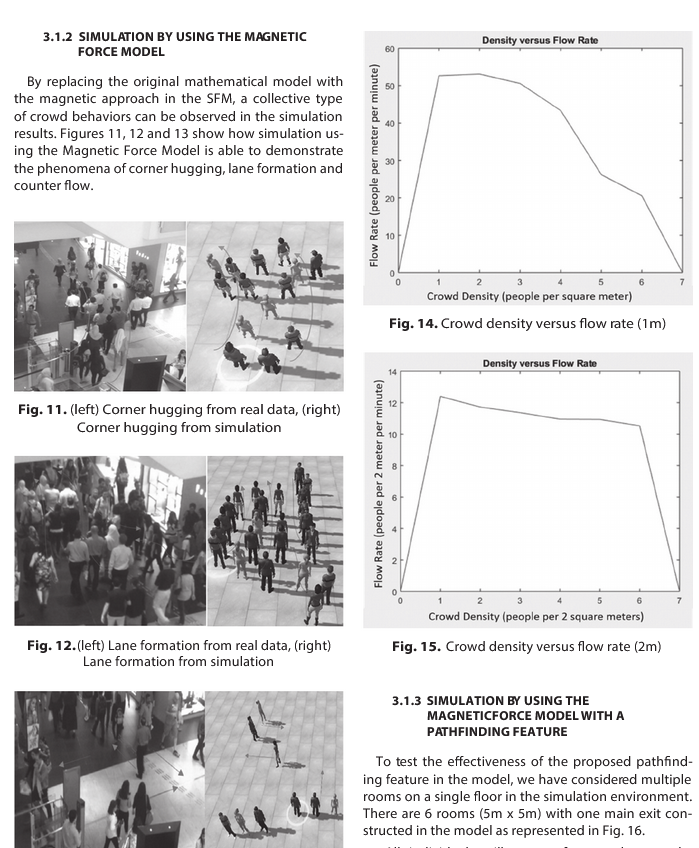
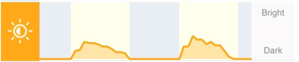

# Internet of Things

IOT data is one very important aspect of eCommerce.
Climatic conditions, weather, festive seasons, events etc. often significantly impact business operations.

Sometimes, it may not be always possible to plan for unplanned catastrophic events, but whenever data is available in advance, it always help tremendously in planning and provide huge opportunity for growth in revenue, branding and building relationships with customer.

Purpose of this section is, to use, weather | climatic | planned events data to help detect "Seasonality" in SARIMA ML Models in AI predictive analytics. 
(SARIMA : seasonal auto regression integrated moving average time series machine learning model).

We will use standard weather and news information from weather.com and NEW API websites.

below are few example datasets `gathered via getPiper IOT device located in Los Angeles CA` to support our analysis.

This section, assume, **implanted IOT sensors** or available **API** to capture vision, density, temperature, moisture, sound and activities.

*not all IOT data mentioned below is used in our analysis.*

---
## events

```@example
using CSV, DataFrames
eventDF = DataFrame(CSV.File("../../assets/sampleData/eventCalendar.csv"))
first(eventDF[:, :], 10)
```

---
## holiday calendar

```@example
using CSV, DataFrames
calendarDF = DataFrame(CSV.File("../../assets/sampleData/calendar.csv"))
first(calendarDF[:, :], 10)
```

---
## temperature

Outside temperature



```@example
##############################################
# outdoorTemp
##############################################
using DataFrames, CSV, Dates, Distributions
sampleSize = 365
weatherDF = DataFrame(
    recordDate = Date("2022-01-01", dateformat"y-m-d"):Day(1):(Date("2022-01-01", dateformat"y-m-d")+ Day(sampleSize-1)),
    cityId = 1:1:sampleSize, 
    state = rand(["LA","LA","FL"], sampleSize),
    indoorTemp = rand(64:1:94, sampleSize),
    outdoorTemp = rand(54:1:104, sampleSize),
    wind = rand(5:1:30, sampleSize),
    humidity = rand(30:1:70, sampleSize),
    precipitation = rand(0:1:5, sampleSize)
    )
first(weatherDF[:, [:recordDate, :cityId, :state, :outdoorTemp]], 10)
```

Inside temperature



```@example
##############################################
# inside temperature
##############################################
using DataFrames, CSV, Dates, Distributions
sampleSize = 365
weatherDF = DataFrame(
    recordDate = Date("2022-01-01", dateformat"y-m-d"):Day(1):(Date("2022-01-01", dateformat"y-m-d")+ Day(sampleSize-1)),
    cityId = 1:1:sampleSize, 
    state = rand(["LA","LA","FL"], sampleSize),
    indoorTemp = rand(64:1:94, sampleSize),
    outdoorTemp = rand(54:1:104, sampleSize),
    wind = rand(5:1:30, sampleSize),
    humidity = rand(30:1:70, sampleSize),
    precipitation = rand(0:1:5, sampleSize)
    )
first(weatherDF[:, [:recordDate, :cityId, :state, :outdoorTemp]], 10)
```
---
## moisture


```@example
##############################################
# moisture
##############################################
using DataFrames, CSV, Dates, Distributions
sampleSize = 365
weatherDF = DataFrame(
    recordDate = Date("2022-01-01", dateformat"y-m-d"):Day(1):(Date("2022-01-01", dateformat"y-m-d")+ Day(sampleSize-1)),
    cityId = 1:1:sampleSize, 
    state = rand(["LA","LA","FL"], sampleSize),
    indoorTemp = rand(64:1:94, sampleSize),
    outdoorTemp = rand(54:1:104, sampleSize),
    wind = rand(5:1:30, sampleSize),
    humidity = rand(30:1:70, sampleSize),
    precipitation = rand(0:1:5, sampleSize)
    )
first(weatherDF[:,[:recordDate,:cityId, :state, :humidity]], 10)
```
---
## sound


```@example
##############################################
# Noise / sound
##############################################
using DataFrames, CSV, Dates, Distributions
sampleSize = 365
weatherDF = DataFrame(
    recordDate = Date("2022-01-01", dateformat"y-m-d"):Day(1):(Date("2022-01-01", dateformat"y-m-d")+ Day(sampleSize-1)),
    cityId = 1:1:sampleSize, 
    state = rand(["LA","LA","FL"], sampleSize),
    indoorTemp = rand(64:1:94, sampleSize),
    sound = rand(54:1:104, sampleSize),
    wind = rand(5:1:30, sampleSize),
    humidity = rand(30:1:70, sampleSize),
    precipitation = rand(0:1:5, sampleSize)
    )
first(weatherDF[:,[:recordDate,:cityId, :state, :sound]], 10)
```

---
## activities
motion activities


```@example
##############################################
# motion activities
##############################################
using DataFrames, CSV, Dates, Distributions
sampleSize = 365
weatherDF = DataFrame(
    recordDate = Date("2022-01-01", dateformat"y-m-d"):Day(1):(Date("2022-01-01", dateformat"y-m-d")+ Day(sampleSize-1)),
    cityId = 1:1:sampleSize, 
    state = rand(["LA","LA","FL"], sampleSize),
    indoorTemp = rand(64:1:94, sampleSize),
    sound = rand(54:1:104, sampleSize),
    shadows = rand(5:1:30, sampleSize),
    humidity = rand(30:1:70, sampleSize),
    precipitation = rand(0:1:5, sampleSize)
    )
first(weatherDF[:,[:recordDate, :cityId, :state, :shadows]], 10)
```

---
## density / vision
Capturing crowd density varies case by case. For example, In case of, organized gatherings like Theme parks, concerts etc.
number of people attending the event can be predicted in advance.

However, at the same, number of people entering, leaving and present at a given time is very important.
Most of the chaos, happens when too many people appear at a place at the same time. for example, people entering / leaving premises.




[Reference](https://www.researchgate.net/publication/343341033_Crowd_Modeling_and_Simulation_for_Safer_Building_Design)

other option is, Density will calculated using vision AI, captured through a motion camera / CCTV footage.



---
## visibility
Brightness



---
## news
